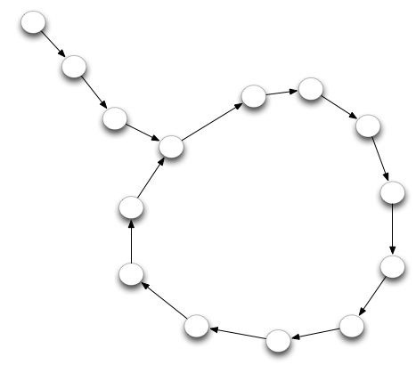

# JS - Node / Algo
*ECV Digital - 22/10/2015*

**Pre-requisites: lesson 1**

---
# Majoration: $O(n)$
We read it: "Big O of n": 

## Example
```javascript
// Given: a = [...] with n elements
var b = [];
for(var i = 0;i < n;i++){
  var m = a[0];
  var mj = 0;
  a.forEach(function(element, j){
    if(element < m){
      m = element;
      mj = j;
    }
  });
  a.splice(mj, 1);
  b.push(m); 
}
```

--
You can say that: $\Theta(n) = \sum_{i=0}^n i$ but if you don't know how to calculate this formula it's clearly of no use

What can we do?

----
We know that $ \Theta(n) = \sum_{i=0}^n i $ and $\forall i: i < n$ <!-- .element: class="fragment" -->

So we can say $ \Theta(n) < \sum_{i=0}^n n => \Theta(n) < n^2 $ <!-- .element: class="fragment" -->

In this case we say we have majored $\Theta(n)$ with $n^2$ <!-- .element: class="fragment" -->
> The $\Theta(n)$ algorithm is $O(n^2)$  

<!-- .element: class="fragment" -->

---
# Recursive $\Theta$
```javascript
function factorial( n ){
  if(n == 1){
    return 1;
  }
  return n * factorial( n - 1 );
}

```
> Complexity: $\Theta(n)$  

<!-- .element: class="fragment" -->

To find the complexity of a recursive function, count the number of instruction until the recursive call.

Note: In this case we find 2: 1 equality and 1 multiplication. This function will then call itself with $n - 1$ and it will stop when $n == 1$.


---
# Logarithm $\Theta$
```javascript
// Given: A = [...] with n elements ordered
function binarySearch(A, n, val){ // This function search a value in an array
  if(n === 1){
    return (A[0] === val);
  }
  m = Math.floor(n/2);
  if(val === A[m]){
    return true;
  }
  if(val < A[m]){
    A.splice(m, n - m);
  } else if(val > A[m]){
    A.splice(0, n - m);
  }
  return binarySearch(A, A.length, val);
}
```

--
If you run by hand the first call of the function, you can see that the length of the array is divided by 2 before the second call.

If we keep going we can see that:
- 0th iteration, A.length = $n$ 
- 1st iteration, A.length = $n/2$ <!-- .element: class="fragment" -->
- ith iteration, A.length = $n/2^i$ <!-- .element: class="fragment" -->
- last iteration, A.length = 1 <!-- .element: class="fragment" -->

If it takes p iteration to finish this algorithm we have: <!-- .element: class="fragment" -->
> $1=\frac{n}{2^p} \Rightarrow 2^p = n \Rightarrow p = \frac{log(n)}{log(2)}$ 
> Complexity: $\Theta(p) \Rightarrow \Theta(\log(n))$  

<!-- .element: class="fragment" -->

Note: log_2(2) = 1; 

---

# Exercices
> For a detailed solution see the [algo.js](https://github.com/morgangiraud/ecvd-js/blob/master/lesson2/exercices/algo.js) exercice file

Calcul the complexity of this code
```javascript
for(var i = n; i>1; i = Math.floor(i/2) ) {
  for(var j = 1; j < n; j *= 2 ) {
    for(var k = 0; k < n; k += 2 ) {
      ... // constant number C of operations
    }
  }
}
```
> Complexity: $\Theta(n*\log(n)^2)$  

<!-- .element: class="fragment" -->

--
# Exercices
Calcul the complexity of this code
```javascript
for(var i = 1; i < n; i *= 2 ) {
  for(var j = n; j > 0; j /= 2 ) { 
    for(var k = j; k < n; k += 2 ) {
      sum += (i + j * k );
    }
  }
}
```
> Complexity: $\Theta(n*\log(n)^2)$  

<!-- .element: class="fragment" -->

--
# Exercices

First, calcul a majoration  of this code and then find the complexity.
```javascript
for(var i = n; i > 0; i-- ) { // i = n, n-1, ..., 2, 1
  for(var j = 1; j < n; j *= 2 ) { // j = 1, 2, 4, 8, 16 ... 2^m
    for(var k = 0; k < j; k++ ) { // 
      ... // constant number C of operations
    }
  }
}
```
> Majoration: $O(n^2 *log(n))$  

<!-- .element: class="fragment" -->

> Complexity: $\Theta(n^2)$  

<!-- .element: class="fragment" -->

---
#Homework
##Description
You are given a node that is the beginning of a linked list. This list always contains a tail and a loop.
Your objective is to determine the length of the loop.

--
## Example
In the following picture the tail's size is 3 and the loop size is 11.



--
- Copy the chain.js file into your own folder
- Create your loppSize function
- Run the tests using `node my-folder/chain.js`
- When you succeed, commit your work and create a pull request.

> Credit to [Codewar](http://www.codewars.com/)


